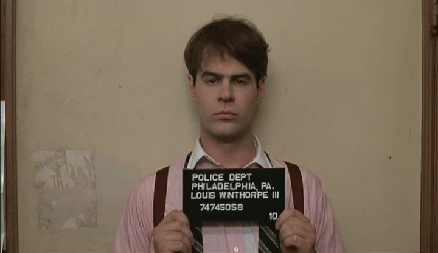

<section>
  <article class="feature">
    
  </article>
  <article class="feature">
    <h1>About us</h1>

    
Together our team has over 20 years of experience in Commercial Real Estate brokerage, law, and management.

  </article>
</section>

<section class="team col-3">

  <article>
    
    
Founder Henry Moore was most recently a Vice President with Colliers International South Carolina. Before Colliers, Henry worked in both sales and management in the technology and medical device industries.

    <a href="" class="button">social</a>
  </article>

  <article>
    
    
Founder David Collier is a former real estate attorney and served in multiple executive leadership positions in the Commercial Real Estate management industry.

    <a href="" class="button">social</a>
  </article>

  <article>
    
    
Lead Developer Tyler Youngblood comes to REsimplifi after working in development for Colonial Life. Previously Tyler served as Computer Science faculty at Highline College in Washington State.

    <a href="" class="button">social</a>
  </article>

</section>

<section class="open-letter">

  <h1>A note from our founder</h1>

  
Prior to working in Commercial Real Estate, I used process management software products that helped a great deal with my productivity and efficiency. After moving into the Commercial Real Estate space, I became frustrated by the lack of quality process management software tools available. I reached out to a colleague and together we explored the viability of creating a product for commercial real estate. We discovered that across the board agents were using little to no technology in their day to day business. The few that did use software products, felt that they were too cumbersome and complex. Most were just creating and printing documentsusing word processing templates and storing them in manila folders and envelopes. In REsimplifi, we created a product that is focused on process and documnet management.

  <ul>
    <li>It strips away unnecessary functionality.</li>
    <li>It builds metrics &amp; user input around transaction documents thereby eliminating
unnecessary administrative downtime.</li>
    <li>It creates standards for reporting and forecasting.</li>
    <li>It tracks important events.</li>
  </ul>

  
We differ from other products because we focus on simplicity. We embrace a less is more mentality. We know that most agents have little time on their hands. They shouldn’t be tied to their desks. They want to be out selling. We offer a solution that lets them do that.

  
We hope REsimplifi complements your efforts in the field.

  <section class="signature">
    
    

      
Regards,

      </img>
      
H. Moore

    

  </section>

</section>
