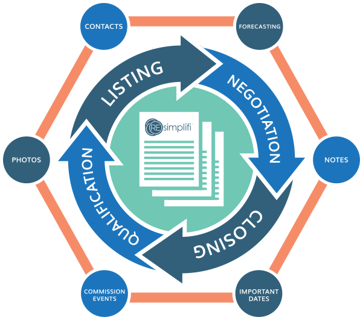

<section class="about">

  <section>
    <article>
      
    </article>
    <article>
      

        <h2>Resimplifi simplifies the Commercial Real Estate process:</h2>
        <ul>
          <li>Reducing agent paperwork
            <ul>
              <li>administrative work</li>
            </ul>
          </li>
          <li>Eliminating redundant manual entry
            <ul>
              <li>user enters information one time and documents are populated throughout a process</li>
            </ul>
          </li>
          <li>Reducing E&amp;O Liability
            <ul>
              <li>decreasing risk of errors and omissions in tracking commissions and contract dates</li>
            </ul>
          </li>
          <li>Increasing accuracy in sales forecasting
            <ul>
              <li>eliminating the human element in estimating the percent of a deal closed</li>
            </ul>
          </li>
          <li>Ramp up new agents faster
            <ul>
              <li>clearly outlining the transaction process at the beginning of the sales cycle</li>
            </ul>
          </li>
        </ul>
      

      <!--  -->
    </article>

  </section>

</section>
