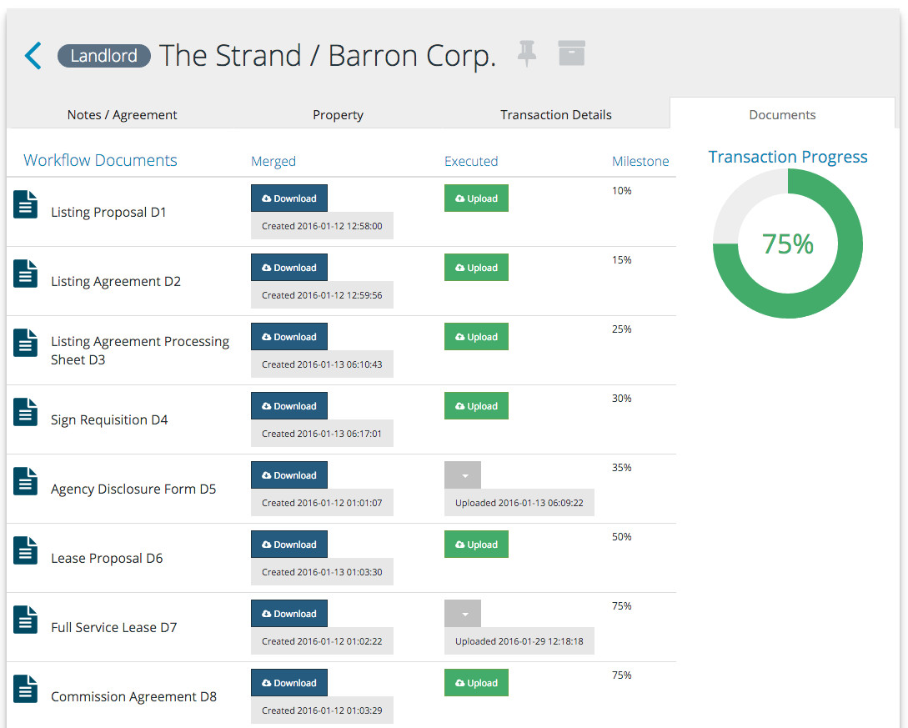
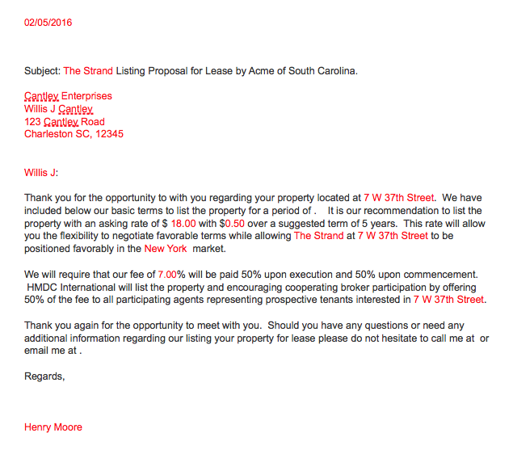

<section>
  <article class="flex-order-2">
    
  </article>
  <article class="flex-order-1">
    <h1>Enter transaction information once.</h1>

    
At its core, the Commercial Real Estate process is all about the documents necessary to progress through and close a transaction. REsimplifi streamlines the complicated and burdensome administrative tasks and steps that encumber the CRE process. REsimplifi automates your document creation process and eliminates redundant manual entry. A simple solution. 

  </article>
</section>

<section>
  <article>
    <h1>Transaction information is automatically merged into all your documents.</h1>

    
At its core, the Commercial Real Estate process is all about the documents necessary to progress through and close a transaction. REsimplifi streamlines the complicated and burdensome administrative tasks and steps that encumber the CRE process. REsimplifi automates your document creation process and eliminates redundant manual entry. A simple solution. 

  </article>
  <article>
    
  </article>
</section>

<section class="col-1">
  <h1>REsimplifi - a small investment with huge dividends.</h1>
  <h2>Subscriptions starting at just $120/month</h2>
  <a href="" class="button big-button">Sign up today</a>
  

    <a href="" class="button">Request Demo</a>
    <a href="" class="button">Contact Us</a>
  

</section>
